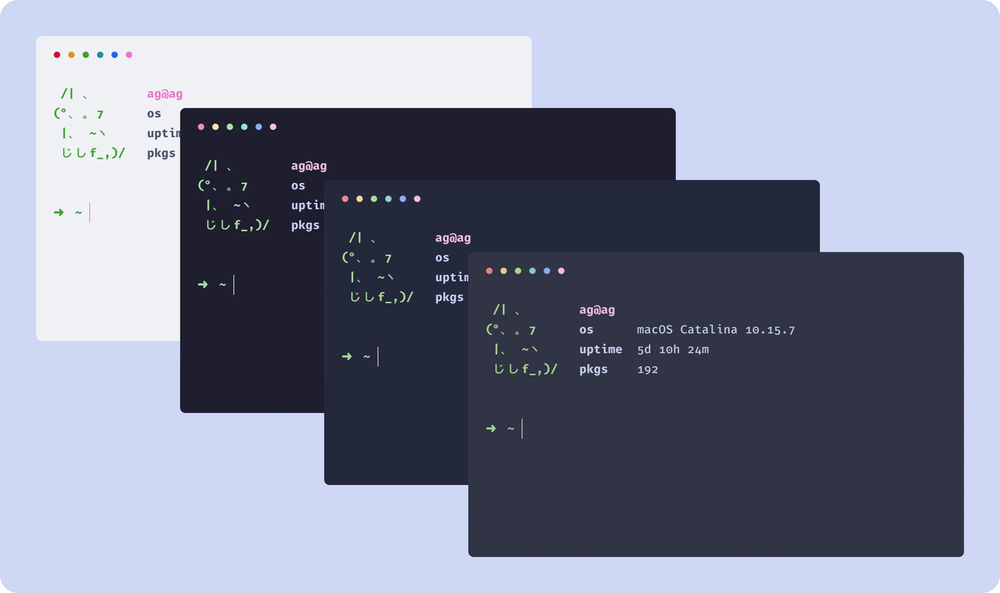

<h3 align="center">
	<br/>
	
	Catppuccin for <a href="https://github.com/alacritty/alacritty">Alacritty</a>
	
</h3>

<p align="center">
    <a href="https://github.com/catppuccin/alacritty/stargazers"></a>
    <a href="https://github.com/catppuccin/alacritty/issues"></a>
    <a href="https://github.com/catppuccin/alacritty/contributors"></a>
</p>

<p align="center">
  
</p>


## Usage

1. Clone this repository next to your Alacritty config file (usually stored at `~/.config/alacritty/alacritty.yml`), with e.g.
```
git clone https://github.com/catppuccin/alacritty.git ~/.config/alacritty/catppuccin
```

2. Import the desired flavour config in your `alacritty.yml`:
```yaml
import:
  # uncomment the flavour you want below:
  - ~/.config/alacritty/catppuccin/catppuccin-mocha.yml
#  - ~/.config/alacritty/catppuccin/catppuccin-macchiato.yml
#  - ~/.config/alacritty/catppuccin/catppuccin-frappe.yml
#  - ~/.config/alacritty/catppuccin/catppuccin-latte.yml
```

## 🙋 FAQ

- Q: **_"Help! the colors don't look like in the demo while I'm on Tmux. What do I do?"_**
  A: The solution is two-fold. First, make sure you have the following set in `alacritty.yml`:

```yml
env:
  TERM: xterm-256color
```

Second, make sure you have the following in your `tmux.conf`:

```
set -g default-terminal "xterm-256color"
set-option -ga terminal-overrides ",xterm-256color:Tc"
```

Now you should be all set!

## 💝 Thanks to

- [VictorTennekes](https://github.com/VictorTennekes)
- [Andreas Grafen](https://github.com/andreasgrafen)

&nbsp;

<p align="center"></p>
<p align="center">Copyright &copy; 2021-present <a href="https://github.com/catppuccin" target="_blank">Catppuccin Org</a>
<p align="center"><a href="https://github.com/catppuccin/catppuccin/blob/main/LICENSE"></a></p>
