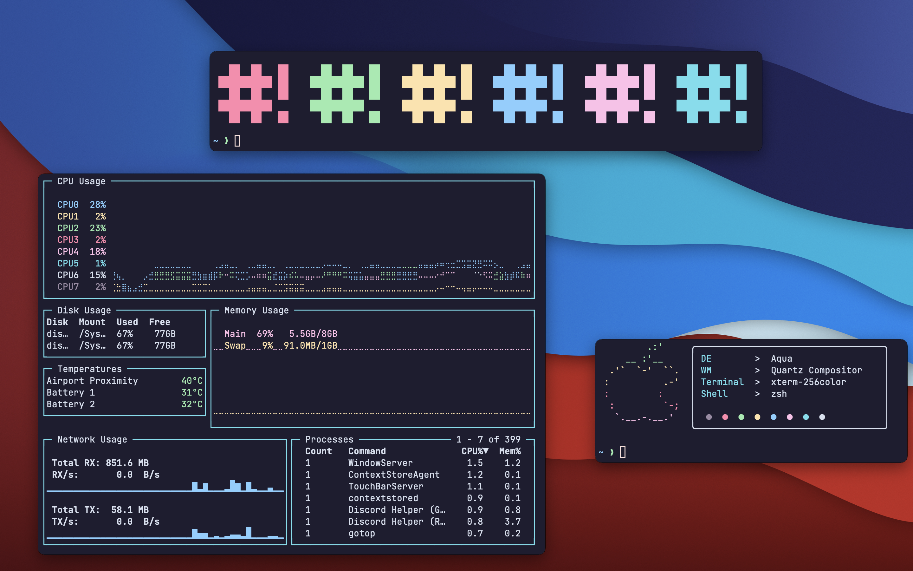

<h3 align="center">
	<br/>
	
	Catppuccin for Alacritty
	
</h3>

<p align="center">
    <a href="https://github.com/catppuccin/alacritty/stargazers"></a>
    <a href="https://github.com/catppuccin/alacritty/issues"></a>
    <a href="https://github.com/catppuccin/alacritty/contributors"></a>

<p align="center">
  
</p>


## Usage

1. Copy the contents of `catppuccin.yml` into your Alacritty config file (usually stored at `~/.config/alacritty/alacritty.yml`)

## 🙋 FAQ

- Q: **_"Help! the colors don't look like in the demo while I'm on Tmux. What do I do?"_**
  A: The solution is two-fold. First, make sure you have the following set in `alacritty.yml`:

```yml
env:
  TERM: xterm-256color
```

Second, make sure you have the following in your `tmux.conf`:

```
set -g default-terminal "xterm-256color"
set-option -ga terminal-overrides ",xterm-256color:Tc"
```

Now you should be all set!

## 💝 Thanks to

- [Pocco81](https://github.com/Pocco81)
- [VictorTennekes](https://github.com/VictorTennekes)