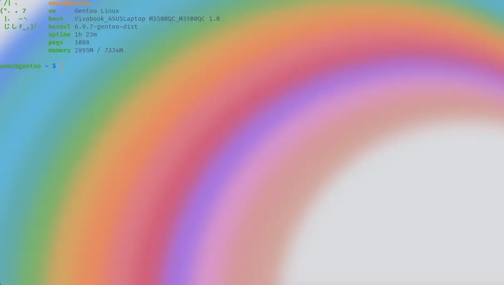

<h3 align="center">
	<br/>
	
	Catppuccin for <a href="https://github.com/alacritty/alacritty">Alacritty</a>
	
</h3>

<p align="center">
    <a href="https://github.com/catppuccin/alacritty/stargazers"></a>
    <a href="https://github.com/catppuccin/alacritty/issues"></a>
    <a href="https://github.com/catppuccin/alacritty/contributors"></a>
</p>

<p align="center">
  
</p>

## Previews

<details>
  <summary>🌻 Latte</summary>
  
</details>
<details>
  <summary>🪴 Frappé</summary>
  
</details>
<details>
  <summary>🌺 Macchiato</summary>
  
</details>
<details>
  <summary>🌿 Mocha</summary>
  
</details>

## Usage

> [!NOTE]  
> Please see the [`yaml`](https://github.com/catppuccin/alacritty/tree/yaml) tag if you need the config in YAML format.

1. Copy the theme files next to your `alacritty.toml` configuration file.
   See [Alacritty's README](https://github.com/alacritty/alacritty#configuration) to see where your config file can be
   stored, it is usually stored at `~/.config/alacritty/alacritty.toml`

    - Latte
      ```shell
      curl -LO --output-dir ~/.config/alacritty https://github.com/catppuccin/alacritty/raw/main/catppuccin-latte.toml
      ```

    - Frappé
      ```shell
      curl -LO --output-dir ~/.config/alacritty https://github.com/catppuccin/alacritty/raw/main/catppuccin-frappe.toml
      ```

    - Macchiato
      ```shell
      curl -LO --output-dir ~/.config/alacritty https://github.com/catppuccin/alacritty/raw/main/catppuccin-macchiato.toml
      ```

    - Mocha
      ```shell
      curl -LO --output-dir ~/.config/alacritty https://github.com/catppuccin/alacritty/raw/main/catppuccin-mocha.toml
      ```

2. Import the desired flavour config in your `alacritty.toml`:

    ```toml
    import = [
      # uncomment the flavour you want below:
      "~/.config/alacritty/catppuccin-latte.toml"
      # "~/.config/alacritty/catppuccin-frappe.toml"
      # "~/.config/alacritty/catppuccin-macchiato.toml"
      # "~/.config/alacritty/catppuccin-mocha.toml"
    ]
    ```

## 🙋 FAQ

- Q: **_"My colours don't look the same as the previews. What do I do?"_**\
  A: Make sure you have the following set in `alacritty.toml`:

  ```toml
  [env]
  TERM = "xterm-256color"

  [window]
  opacity = 0.4
  ```

- Q: **_"What font have you used in the screenshots above?"_**\
  A: [Fira Code](https://github.com/tonsky/FiraCode)

- Q: **_"Where can i get the wallpapers you used in the screenshots above?"_**
- A: You can get them riight here:
  
- [Latte](https://media.discordapp.net/attachments/1211770209011241030/1224301568334106734/latte_rainbow_1.png?ex=66852530&is=6683d3b0&hm=9994cdc78a21d27c790ee1f3f387e2873fdef288d2cfb2156764b80b93b56c8c&=&format=webp&quality=lossless&width=1193&height=671)

- [Frappe](https://media.discordapp.net/attachments/1211770209011241030/1224301568837287956/frappe_rainbow_1.png?ex=66852530&is=6683d3b0&hm=69acf27644a3c054b040c30024652ef24180741c5cbdfcbc244cd160c08c23f6&=&format=webp&quality=lossless&width=1193&height=671)

- [Macchiato](https://media.discordapp.net/attachments/1211770209011241030/1224301569642729585/macchiato_rainbow_1.png?ex=66852530&is=6683d3b0&hm=c620e62adf42adeca92c34ed20ee623375c481fa5c893505d98b89be92a8763d&=&format=webp&quality=lossless&width=1193&height=671)

- [Mocha](https://media.discordapp.net/attachments/1211770209011241030/1224301570381058058/mocha_rainbow_1.png?ex=66852530&is=6683d3b0&hm=0a0ba14465fc58896acddc540649ce9447daa9997c62ffa6065e22a1946ef866&=&format=webp&quality=lossless&width=1193&height=671)


## 💝 Thanks to

- [VictorTennekes](https://github.com/VictorTennekes)
- [Andreas Grafen](https://github.com/andreasgrafen)

&nbsp;

<p align="center"></p>
<p align="center">Copyright &copy; 2021-present <a href="https://github.com/catppuccin" target="_blank">Catppuccin Org</a>
<p align="center"><a href="https://github.com/catppuccin/catppuccin/blob/main/LICENSE"></a></p>
